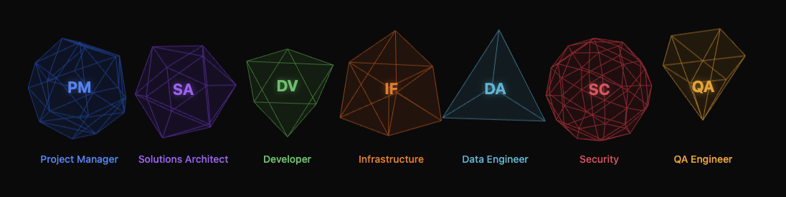

# CloudCrew

<table>
<tr>
<td width="35%" style="text-align: center;">

</td>
<td width="65%" style="padding-left: 20px;">

## Welcome to CloudCrew

**CloudCrew** is an AI-powered delivery team that executes your project from requirements to production. As the project manager, I coordinate between you and our 7 specialized agents to bring your vision to life.

</td>
</tr>
</table>

---

## What CloudCrew Does

CloudCrew works with you to identify your project's unique requirements, then autonomously executes the entire delivery—from architecture and design through production deployment and handoff—with your approval at every milestone.


Here's how it works:

1. **Onboarding Phase** — Team gathers requirements, clarifies scope, and generates a detailed Statement of Work (SOW). You approve the plan before moving forward.

2. **Architecture Phase** — Team designs the system end-to-end. Deliverables: architecture diagrams, Architectural Decision Records (ADRs) explaining tradeoffs, cost estimates, and security review.

3. **POC Phase** — Team builds a working proof of concept. Deliverables: working code, load testing results, and security validation.

4. **Production Phase** — Team scales the POC to production-ready code. Deliverables: full source code, infrastructure-as-code (Terraform), CI/CD pipelines, comprehensive test suites, and final security audit.

5. **Handoff Phase** — Team prepares you for independence. Deliverables: operations runbooks, API documentation, troubleshooting guides, and knowledge transfer sessions.

**At every phase gate, you review deliverables and decide: approve to continue, or request changes.** If changes are needed, the team re-runs the phase with your feedback. No waiting on human coordination — the Swarm self-organizes internally.

---

## Demo (In-Browser)

**[Try the Interactive Demo →](https://jjricks6.github.io/CloudCrew/)**

Watch a full engagement unfold in your browser:
- Onboarding → Architecture → POC → Production → Handoff phases
- Real-time agent collaboration visualization
- Interactive phase reviews with artifact preview
- Chat interface for Q&A during review

Interested in deploying this yourself? Check out deployment instructions below.

---

## Meet the Team



Each agent specializes in their domain and brings deep expertise to every project:

| Agent | Responsibilities |
|-------|------------------|
| **Project Manager** | Owns the engagement. Gathers requirements, plans phases, compiles deliverables, and communicates with you at every milestone. |
| **Solutions Architect** | Designs the overall system. Creates ADRs explaining architectural tradeoffs, cost analysis, and technology recommendations. |
| **Developer** | Implements features. Writes production-quality code, handles integrations, and reviews peer work. |
| **Infrastructure** | Builds the infrastructure. Writes Terraform, sets up CI/CD pipelines, manages cloud resources, and ensures scalability. |
| **Data Engineer** | Designs databases and data pipelines. Creates schemas, migration strategies, and ensures data quality. |
| **Security Engineer** | Threat models and validates. Performs security reviews, scans code & IaC, ensures compliance. |
| **QA Engineer** | Validates everything. Writes test strategies, runs regression tests, verifies load handling, and sign-off on release readiness. |

---

## Architecture

### Two-Tier Orchestration

```
AWS Step Functions (hours/days timescale)
├── Phase: Onboarding
│   ├── Approval Gate: Customer reviews deliverables
├── Phase: Architecture
│   ├── Approval Gate
├── Phase: POC
│   ├── Approval Gate
├── Phase: Production
│   ├── Approval Gate
├── Phase: Handoff
│   └── Retrospective (internal, no approval)
```

**Tier 1 — Phase Orchestration (Step Functions):**
Manages project lifecycle as a state machine. Phases execute sequentially with durable approval gates using `waitForTaskToken`. Customers review phase deliverables; if approved, next phase begins; if revision needed, agents re-run with feedback.

**Tier 2 — Within-Phase Collaboration (Strands Swarm):**
All 7 agents run as a Swarm in every phase, enabling emergent collaboration. Agents hand off work based on task completion (not pre-configured workflows), review each other's outputs, and self-organize based on the phase's execution timeout.

### Infrastructure

| Component | Technology | Why |
|-----------|-----------|-----|
| **Phase orchestration** | AWS Step Functions | Durable state machine; supports long-lived approval gates |
| **Agent execution** | ECS Fargate | Swarms exceed Lambda's 15-min limit; persistent connection needed for interrupts |
| **Agents & handoffs** | Strands Agents SDK | Native support for agent coordination, tool use, and interrupts |
| **LLM API calls** | Amazon Bedrock (Claude Sonnet and Opus 4.6) | Serverless model access; $3/$5/MTok input, $15/$25/MTok output; no infrastructure management |
| **Memory** | AgentCore Memory (STM/LTM) | Persistent memory across agent invocations; search via Bedrock KB |
| **Task ledger** | DynamoDB | Immutable task record; global view of project state |
| **Artifacts** | Git repository | Version control for all deliverables; audit trail |
| **Dashboard** | React SPA | Real-time agent activity, phase timeline, artifact browser, chat |

### Cost & Operations

**Monthly Baseline:** ~$60-130 (dev environment with Bedrock LLM calls)

- Infrastructure (Step Functions, Fargate, DynamoDB, etc.): ~$50
- Bedrock LLM calls (5-50M tokens during development): ~$10-80

**Deployment:** Manual (Terraform) — CI never applies infrastructure. See [Deployment Guide](docs/architecture/implementation-guide.md#deployment).

**Scaling:** Step Functions handles project queuing; Fargate scales task count; DynamoDB on-demand pricing scales usage.

**Observability:** CloudWatch Logs, X-Ray traces, custom metrics dashboard.

### Agent Specialization & Tools

| Agent | Responsibilities | Tools |
|-------|-----------------|-------|
| **PM** | Project planning, requirements management, approval reviews | SOW parsing, task ledger management, deliverable compilation |
| **Solutions Architect** | System design, architecture documentation, ADRs | Architecture templates, cost analysis tools |
| **Infrastructure** | IaC, CI/CD, deployment pipelines | Terraform templates, AWS provider knowledge |
| **Development** | Feature implementation, code quality | Git operations, code review tools |
| **Data** | Database design, data pipeline architecture | Schema templates, migration tools |
| **Security** | Threat modeling, security reviews, compliance | Security scanning tools, vulnerability databases |
| **QA** | Test strategy, coverage analysis, release readiness | Test generation tools, coverage reporting |

### State Management

**Global State (DynamoDB Task Ledger):**
- Project metadata, current phase, approval status
- Phase deliverables and metrics
- Customer feedback and revision context
- TTL-based automatic cleanup

**Agent Memory (AgentCore Memory):**
- Short-term memory: Current task context, recent decisions
- Long-term memory: Pattern library, learned patterns from past projects
- Search capability via Bedrock Knowledge Base

**Artifact Versioning (Git):**
- Every deliverable committed with timestamp
- Immutable audit trail
- Rollback capability if needed

---

## Deploy to AWS

### Prerequisites

- AWS account with appropriate IAM permissions
- Terraform 1.5+
- Python 3.12+
- Node.js 18+

### One-Time Setup

```bash
# 1. Deploy bootstrap infrastructure (S3 state bucket, DynamoDB lock table)
make tf-init  # Creates remote state
make tf-bootstrap

# 2. Deploy main infrastructure
cd infra/terraform
make tf-plan
make tf-apply

# 3. Build and push Docker image for ECS
make docker-build
make docker-push
```
---

## Troubleshooting

### Agent Stalls or Doesn't Progress

**Check task execution:**
```bash
# View latest project state
python -m src.state.ledger --project-id <id>

# Check agent logs in CloudWatch
aws logs tail /aws/ecs/cloudcrew-phase-runner --follow
```

**Check for rate limiting:**
- Verify DynamoDB throttling isn't occurring
- Check CloudWatch metrics for task count

### Phase Approval Gate Timeout

**If customer hasn't approved after 7 days:**
```bash
# Get task token from Step Functions
aws stepfunctions describe-execution --execution-arn <arn>

# Send heartbeat to keep alive
aws stepfunctions send-task-heartbeat --task-token <token>

# Or send success/failure
aws stepfunctions send-task-success --task-token <token> --task-output '{}'
```

### Dashboard Can't Connect to Backend

**Check WebSocket connection:**
```bash
# Verify API endpoint is correct in dashboard/.env
API_URL=http://localhost:8000

# Check backend is running
lsof -i :8000
```

---

## Documentation

| Document | Purpose |
|----------|---------|
| [Final Architecture](docs/architecture/final-architecture.md) | Definitive architecture reference with state machine, phases, and design decisions |
| [Agent Specifications](docs/architecture/agent-specifications.md) | Agent roles, capabilities, system prompts, tool access |
| [Implementation Guide](docs/architecture/implementation-guide.md) | Setup, deployment, cost management, troubleshooting |
| [ADR Index](docs/architecture/) | Architectural decision records for all major choices |
| [Research Documents](docs/research/) | Framework comparison, memory architecture, coordination patterns |

---

## Contributing

### Reporting Bugs

1. Check [existing issues](https://github.com/jjricks6/CloudCrew/issues)
2. Create a new issue with:
   - Reproduction steps
   - Expected vs. actual behavior
   - CloudWatch logs (if applicable)
   - Your environment (Python version, OS, AWS region)

### Proposing Features

1. Open a discussion in [Discussions](https://github.com/jjricks6/CloudCrew/discussions)
2. Describe the use case and desired behavior
3. If accepted, create an ADR to document the decision

---

## License

This project is proprietary. See [LICENSE](LICENSE) for details.

---

## Support

- **Documentation:** [docs/](docs/)
- **Issues:** [GitHub Issues](https://github.com/jjricks6/CloudCrew/issues)
- **Discussions:** [GitHub Discussions](https://github.com/jjricks6/CloudCrew/discussions)

---

## Changelog

See [CHANGELOG.md](CHANGELOG.md) for version history.

---

**Built with [Strands Agents SDK](https://docs.strands.com) | Deployed on [AWS](https://aws.amazon.com) | Inspired by [real software teams](https://en.wikipedia.org/wiki/Agile_software_development)**
