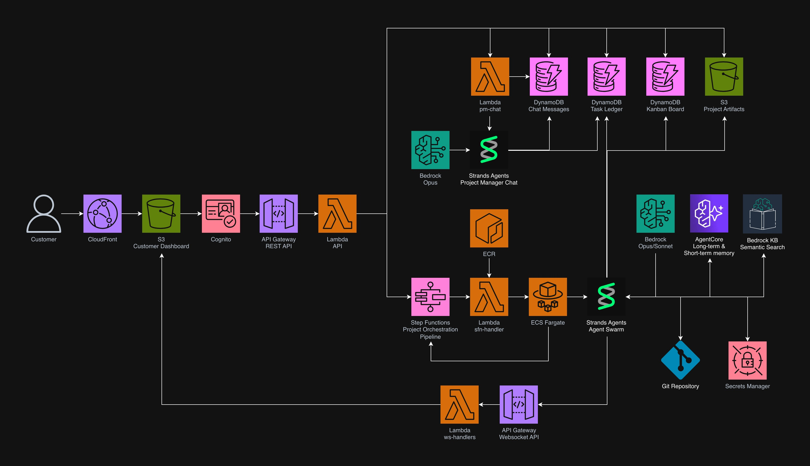

# CloudCrew

<table>
<tr>
<td width="35%" style="text-align: center;">

</td>
<td width="65%" style="padding-left: 20px;">

## Welcome to CloudCrew

**CloudCrew** is an AI-powered delivery team that executes your project from requirements to production. As the project manager, I coordinate between you and our 7 specialized agents to bring your vision to life.

</td>
</tr>
</table>


## What CloudCrew Does

CloudCrew works with you to identify your project's unique requirements, then autonomously executes the entire delivery—from architecture and design through production deployment and handoff—with your approval at every milestone.


Here's how it works:

1. **Discovery Phase** — Team gathers requirements, clarifies scope, and generates a detailed Statement of Work (SOW). You approve the plan before moving forward.

2. **Architecture Phase** — Team designs the system end-to-end. Deliverables: architecture diagrams, Architectural Decision Records (ADRs) explaining tradeoffs, cost estimates, and security review.

3. **POC Phase** — Team builds a working proof of concept. Deliverables: working code, load testing results, and security validation.

4. **Production Phase** — Team scales the POC to production-ready code. Deliverables: full source code, infrastructure-as-code (Terraform), CI/CD pipelines, comprehensive test suites, and final security audit.

5. **Handoff Phase** — Team prepares you for independence. Deliverables: operations runbooks, API documentation, troubleshooting guides, and knowledge transfer sessions.

**At every phase gate, you review deliverables and decide: approve to continue, or request changes.** If changes are needed, the team re-runs the phase with your feedback. No waiting on human coordination — the Swarm self-organizes automatically.

### Demo
Ready to see CloudCrew in action? Click the button below to go through an interactive demo!

[](https://jjricks6.github.io/CloudCrew/project/demo)


Ready to deploy your own instance? See [Deployment](#deployment).

---

## Meet the Team


Each agent specializes in their domain and brings deep expertise to every project:

| Agent | Responsibilities |
|-------|------------------|
| **Project Manager** | Owns the engagement. Gathers requirements, plans phases, compiles deliverables, and communicates with you at every milestone. |
| **Solutions Architect** | Designs the overall system. Creates ADRs explaining architectural tradeoffs, cost analysis, and technology recommendations. |
| **Developer** | Implements features. Writes production-quality code, handles integrations, and reviews peer work. |
| **Infrastructure** | Builds the infrastructure. Writes Terraform, sets up CI/CD pipelines, manages cloud resources, and ensures scalability. |
| **Data Engineer** | Designs databases and data pipelines. Creates schemas, migration strategies, and ensures data quality. |
| **Security Engineer** | Threat models and validates. Performs security reviews, scans code & IaC, ensures compliance. |
| **QA Engineer** | Validates everything. Writes test strategies, runs regression tests, verifies load handling, and sign-off on release readiness. |

---

## Tech Stack

| Layer | Technology |
|-------|------------|
| Agent framework | [Strands Agents SDK](https://strandsagents.com) (Swarm pattern) |
| Orchestration | AWS Step Functions (durable `waitForTaskToken` gates) |
| Compute | ECS Fargate (phase execution), Lambda (APIs + glue) |
| Models | Amazon Bedrock — Claude Opus 4.6 (reasoning), Sonnet (execution) |
| Memory | AgentCore Memory (STM/LTM), Bedrock Knowledge Bases (artifact search) |
| State | DynamoDB (6 tables, on-demand), S3 (4 buckets) |
| Frontend | React SPA on CloudFront + S3, WebSocket real-time push |
| Auth | Amazon Cognito (email-based, JWT) |
| IaC | Terraform (remote state in S3 + DynamoDB lock) |

---

## Architecture

CloudCrew uses a two-tier orchestration model: **AWS Step Functions** manages the project lifecycle across phases (hours to days), while **Strands Swarms** handle agent collaboration within each phase (minutes to hours). This separation exists because project timescales demand durable state (customers may take days to review deliverables), while agent collaboration requires low-latency handoffs within a single process.

### System Overview



### Customer Dashboard

The dashboard is a React SPA hosted on CloudFront + S3 with two API connections:

**REST API** (API Gateway → Lambda) handles all customer actions. Two Lambda functions serve all endpoints: the `api` Lambda routes 9 endpoints (project CRUD, status, chat, upload, artifacts, kanban tasks, interrupt responses), and the `approval` Lambda handles 2 endpoints (approve/revise) that need Step Functions `SendTaskSuccess`/`SendTaskFailure` permissions.

**WebSocket API** (API Gateway → Lambda) provides real-time push. A single `ws-handlers` Lambda manages the connection lifecycle. On `$connect`, it validates the Cognito JWT and stores the connection ID in DynamoDB (with 2-hour TTL). Any backend component that needs to push an event calls `broadcast_to_project()`, which queries the connections table and calls `PostToConnection` for each client.

Events pushed over WebSocket include: `phase_started`, `awaiting_approval`, `chat_message`, `interrupt_raised`, `interrupt_answered`, `task_created`, `task_updated`, `activity_event`, and `review_message`. The dashboard never polls — all updates after initial page load arrive via WebSocket.

**Authentication** uses Amazon Cognito (email-based sign-up, JWT tokens). The REST API uses a Cognito authorizer on API Gateway. The WebSocket API validates JWTs inside the Lambda handler (API Gateway WebSocket authorizers can't read query string parameters).

### Step Functions Orchestration

The state machine is the spine of every project. It manages the full delivery lifecycle as a sequence of phase executions with durable approval gates:

```
Discovery ─► PM Review ─► Approval Gate ─┐
                                         │ Approved
Architecture ◄───────────────────────────┘
     └─► PM Review ─► Approval Gate ─┐
                                     │ Approved
POC ◄────────────────────────────────┘
     └─► PM Review ─► Approval Gate ─┐
                                     │ Approved
Production ◄─────────────────────────┘
     └─► PM Review ─► Approval Gate ─┐
                                     │ Approved
Handoff ◄────────────────────────────┘
     └─► PM Review ─► Approval Gate ─► Retrospective ─► Complete
```

Each phase follows a three-step pattern:

1. **Phase execution** (`lambda:invoke.waitForTaskToken`) — A Lambda updates the task ledger, broadcasts a `phase_started` event to the dashboard, then launches an ECS Fargate task. Step Functions pauses and waits for the ECS task to call `SendTaskSuccess` when the Swarm completes.

2. **PM Review** (`lambda:invoke`) — A dedicated Lambda runs the PM agent to validate deliverables against the Statement of Work. Returns a `review_passed` boolean.

3. **Approval gate** (`lambda:invoke.waitForTaskToken`) — A Lambda stores the task token in DynamoDB and broadcasts an `awaiting_approval` event. Step Functions pauses indefinitely until the customer clicks Approve or Revise in the dashboard. On revision, the same phase re-runs with customer feedback prepended to the task.

**Why Step Functions over a Strands Graph?** Projects can span days or even weeks. Step Functions provides durable execution state that survives process restarts, built-in `waitForTaskToken` for approval gates that can pause indefinitely, automatic retry with backoff on transient failures, and a full execution history audit trail. A Strands Graph would require custom persistence for all of this.

**Why a Lambda intermediary instead of direct ECS integration?** Step Functions can launch ECS tasks natively, but the Lambda performs critical bookkeeping between "phase decided" and "container running": it updates the task ledger so the customer's status API immediately reflects the new phase, broadcasts a WebSocket event so the dashboard updates instantly, and validates the ECS launch to prevent the state machine from waiting on a task that failed to start.

### Agent Swarm Execution

Each phase runs as a Strands Swarm on an ECS Fargate task. The Swarm is a group of agents that hand off work to each other based on task needs, not pre-configured workflows.

**Why ECS Fargate instead of Lambda?** Two reasons. First, Swarm execution regularly exceeds Lambda's 15-minute timeout — agents performing architecture review, code generation, and security scanning in sequence can run for 30+ minutes. Second, within-phase customer interrupts (HITL questions) require the process to remain alive while polling for a response. ECS has no timeout ceiling.

**Why no ECS Services?** Cost. ECS Services maintain always-running containers. CloudCrew launches individual Fargate Tasks on demand from Step Functions — zero cost when no project is executing. Tasks are torn down after each phase completes.

**How agents access AWS services:**

| Access pattern | Services | Mechanism |
|----------------|----------|-----------|
| **Strands tools** (agent-initiated) | DynamoDB (ledger, board tasks, activity), Bedrock KB, Secrets Manager, STS, S3, Terraform | `@tool`-decorated Python functions with direct boto3 calls |
| **Strands hooks** (automatic per invocation) | AgentCore Memory (STM/LTM), DynamoDB (activity), WebSocket broadcast | `HookProvider` callbacks — agents are unaware |
| **ECS runner** (hardcoded orchestration) | Step Functions, DynamoDB (interrupts, ledger), S3 (artifact sync), Secrets Manager (GitHub PAT), Git | Python code in `src/phases/__main__.py` wrapping the Swarm |
| **Strands framework** (implicit) | Bedrock (model inference) | `BedrockModel` configured at import time — every agent turn |

Agents never use the REST API. They call AWS services directly via boto3 within the ECS container, using the task's IAM role. The REST API exists solely for the customer dashboard.

### Agentic Memory

CloudCrew uses two complementary memory systems that serve different purposes:

**AgentCore Memory (STM/LTM)** stores what agents *thought and decided*. It captures conversational reasoning — the "why" behind decisions.

- **Short-Term Memory (STM):** After every agent invocation, a hook automatically saves the agent's response to STM, scoped to the current phase session. This is a scratchpad of what happened during this phase.
- **Long-Term Memory (LTM):** Before every agent invocation, a hook automatically retrieves relevant LTM records (past decisions, project context from earlier phases) and prepends them to the agent's messages. At phase transitions, an extraction job distills STM into durable LTM records.

Without LTM, agents in later phases would forget decisions from earlier phases — they'd contradict themselves or re-debate settled questions.

**Bedrock Knowledge Base** stores what agents *built*. It provides semantic search over authored artifacts (architecture docs, ADRs, IaC, code, security reviews) indexed from S3.

- Agents call `knowledge_base_search()` explicitly when they need to find something across the project's deliverables (e.g., "find everything related to authentication").
- The KB data source syncs from the Git repo at phase transitions.
- When the KB isn't configured, agents fall back to `git_read` and `git_list` for direct file access.

The two systems have different lifecycles (LTM is extracted from conversations; KB is synced from Git), different access patterns (automatic hook injection vs. explicit tool call), and different data shapes (reasoning traces vs. authored documents).

### Persistent State

Six DynamoDB tables (all on-demand billing, zero cost when idle):

| Table | Purpose | Key pattern | TTL |
|-------|---------|-------------|-----|
| `cloudcrew-projects` | Task ledger — project state, decisions, approval tokens, interrupts, chat history | `PROJECT#{id}` / `LEDGER \| TOKEN#{phase} \| INTERRUPT#{id} \| CHAT#{ts}` | — |
| `cloudcrew-activity` | Agent activity events for dashboard feed | `PROJECT#{id}` / `EVENT#{ts}#{uuid}` | 24h |
| `cloudcrew-board-tasks` | Kanban board tasks managed by agents | `PROJECT#{id}` / `TASK#{phase}#{task_id}` | — |
| `cloudcrew-connections` | WebSocket connection registry | `projectId` / `connectionId` (GSI on connectionId) | 2h |
| `cloudcrew-metrics` | Engagement analytics (Retrospective phase) | `ENGAGEMENT#{id}` / `SUMMARY \| PHASE#{name}` | — |
| `cloudcrew-rate-limits` | API rate limiting per user per minute | `user#{id}#minute#{ts}` | 120s |

The `cloudcrew-projects` table is the central shared state — read and written by every Lambda function and the ECS task. The `cloudcrew-connections` table is written by `ws-handlers` (on connect/disconnect) and read by every component that broadcasts events.

### AWS Services Map

| Service | Role |
|---------|------|
| **Step Functions** | Phase orchestration state machine with durable approval gates |
| **ECS Fargate** | Long-running Swarm execution (on-demand tasks, no services) |
| **ECR** | Container registry — single image for both ECS tasks and all Lambdas |
| **Lambda** (7 functions) | Lightweight APIs (api, approval, ws-handlers), orchestration glue (sfn-handlers), PM agents (pm-review, pm-review-message, pm-chat) |
| **API Gateway** (REST) | Customer-facing REST endpoints with Cognito authorizer |
| **API Gateway** (WebSocket) | Real-time push to dashboard clients |
| **DynamoDB** (6 tables) | Task ledger, activity feed, kanban board, WebSocket connections, metrics, rate limits |
| **S3** (4 buckets) | SOW uploads, KB data source, dashboard static hosting, Terraform remote state |
| **CloudFront** | CDN for React SPA dashboard |
| **Cognito** | Customer authentication (email-based, JWT tokens) |
| **Bedrock** | LLM inference (Opus 4.6 for reasoning agents, Sonnet for execution agents) |
| **Bedrock Knowledge Bases** | Semantic search over project artifacts (S3 data source) |
| **AgentCore Memory** | Short-term and long-term conversational memory |
| **Secrets Manager** | Bedrock API key, customer GitHub PATs, customer AWS credentials |
| **STS** | Customer credential verification (`GetCallerIdentity`) |
| **CloudWatch** | Logs (14-day retention), VPC Flow Logs, Container Insights |
| **VPC** | 2 public subnets, 2 AZs, no NAT Gateway (dev cost optimization) |
| **Budgets** | Spend alerts at 50% forecast and 80% actual |

---

## Deployment

> [!WARNING]
> CloudCrew has been tested end-to-end in a dev environment, but is **not yet ready for production use**.

All deployment is manual. CI validates code quality but never applies infrastructure.

### Prerequisites

| Requirement | Version | Notes |
|-------------|---------|-------|
| AWS CLI | v2 | Configured with credentials (`aws configure`) |
| Terraform | >= 1.5 | [Install guide](https://developer.hashicorp.com/terraform/install) |
| Python | 3.12+ | Required for the agent runtime and toolchain |
| Node.js | 18+ | Required for the React dashboard |
| Docker | 20+ | With `buildx` support for linux/amd64 builds |
| Make | any | Build automation (all commands run via Makefile) |

Your AWS account needs permissions for: ECS, ECR, Lambda, Step Functions, API Gateway, DynamoDB, S3, CloudFront, Cognito, Bedrock, Secrets Manager, IAM, VPC, CloudWatch, and Budgets. An admin-level IAM user or role is recommended for initial setup.

**Enable Bedrock model access** in the AWS console before deploying. Navigate to Amazon Bedrock > Model access and request access to Claude models in your target region (default: `us-east-1`).

### Step 1: Clone and Install

```bash
git clone https://github.com/jjricks6/CloudCrew.git
cd CloudCrew

# Create and activate the virtual environment
python3.12 -m venv .venv
source .venv/bin/activate

# Install Python dependencies (includes dev tools: ruff, mypy, pytest, bandit, checkov)
make install

# Install pre-commit hooks
make install-hooks

# Install dashboard dependencies
cd dashboard && npm install && cd ..

# Verify everything works
make check
```

### Step 2: Bootstrap Terraform State Backend

This creates an S3 bucket and DynamoDB lock table for Terraform remote state. Run once per AWS account. These resources persist permanently (~$0.02/month).

```bash
make bootstrap-init
make bootstrap-apply
```

Bootstrap uses local state (stored in `infra/bootstrap/`). The main infrastructure stack uses the remote backend these resources provide.

### Step 3: Configure Variables

Create `infra/terraform/terraform.tfvars`:

```hcl
aws_region          = "us-east-1"
environment         = "dev"
budget_alert_email  = "your-email@example.com"
monthly_budget_amount = 50
```

Optional variables (defaults are sensible for dev):

```hcl
ecs_cpu              = 1024    # CPU units (1024 = 1 vCPU)
ecs_memory           = 2048    # MiB
enable_auth          = true    # Cognito auth on API Gateway
dashboard_origin     = "*"     # CORS origin (* for dev, CloudFront domain for prod)
```

### Step 4: Deploy Everything

The `make deploy` target runs all steps in the correct order:

```bash
make deploy
```

This executes:

1. `terraform init` — initialize providers and remote state backend
2. `terraform apply` — create all infrastructure + ECR repository (confirm interactively)
3. `docker build` — build the phase runner container image (linux/amd64)
4. `docker push` — authenticate with ECR and push the image
5. `terraform apply` — second pass creates Lambda functions and Step Functions that reference the now-available container image (confirm interactively)
6. `dashboard deploy` — build the React SPA, sync to S3, invalidate CloudFront cache

On completion, the command prints the dashboard URL, REST API URL, and WebSocket API URL.

**Why two Terraform applies?** The first creates the ECR repository. Lambda functions reference a container image in ECR, so they can't be created until the image exists. The second apply creates the Lambdas and Step Functions state machine that depend on the image.

### Step 5: Create a Cognito User

```bash
# Create a user
aws cognito-idp admin-create-user \
  --user-pool-id $(terraform -chdir=infra/terraform output -raw cognito_user_pool_id) \
  --username your-email@example.com \
  --user-attributes Name=email,Value=your-email@example.com \
  --temporary-password TempPass123!

# Set permanent password (after first login or directly)
aws cognito-idp admin-set-user-password \
  --user-pool-id $(terraform -chdir=infra/terraform output -raw cognito_user_pool_id) \
  --username your-email@example.com \
  --password YourSecurePassword123! \
  --permanent
```

### Teardown

Run `make teardown` to stop all running ECS tasks and Step Functions executions, then destroy all infrastructure:

```bash
make teardown
```

This stops active workloads first (ECS tasks, Step Functions executions) to prevent hanging resource deletions, then runs `terraform destroy`. Bootstrap resources (S3 state bucket, DynamoDB lock table) are not destroyed — they persist for future deployments.

### Individual Targets

For incremental updates after the initial deploy:

```bash
# Rebuild and push only the Docker image (after code changes)
make docker-build && make docker-push

# Redeploy only the dashboard (after frontend changes)
make dashboard-deploy

# Re-run only Terraform (after infra changes)
make tf-plan    # Review changes
make tf-apply   # Apply changes

# Run full CI check suite (lint, typecheck, test, security, Terraform validate)
make check
```

### Cost Expectations (Dev Environment)

All resources use on-demand or pay-per-use pricing. When no project is running, the only costs are storage:

| Service | Estimated Monthly Cost | Notes |
|---------|----------------------|-------|
| Bedrock (LLM inference) | $10–80 | Dominant cost. Depends on token volume per engagement. |
| ECS Fargate | $5–20 | Per-task billing. Zero when idle. |
| DynamoDB | $1–5 | On-demand. Six tables, zero cost when idle. |
| S3 + CloudFront | $1–3 | Minimal storage and traffic in dev. |
| Lambda | $0–2 | Free tier covers most dev usage. |
| API Gateway | $1–3 | $3.50/M REST requests, $1/M WebSocket messages. |
| CloudWatch | $0.50–1 | 14-day log retention, ~$0.50/GB ingested. |
| Other (VPC, Cognito, ECR, Secrets Manager) | ~$1 | VPC is free. Cognito free tier: 50K MAU. |
| **Total** | **~$20–115** | Scales with Bedrock token usage per engagement. |

No NAT Gateways (saves ~$32/month), no ECS Services (saves idle compute), no provisioned DynamoDB (saves fixed capacity costs). Budget alarms fire at 50% forecast and 80% actual spend.

---

## Documentation

| Document | Contents |
|----------|----------|
| [Final Architecture](docs/architecture/final-architecture.md) | Definitive architecture reference — state machine, phase composition, agent coordination, error handling |
| [Agent Specifications](docs/architecture/agent-specifications.md) | Agent roles, system prompts, tool access, and model assignments |
| [Implementation Guide](docs/architecture/implementation-guide.md) | Project structure, module boundaries, deployment procedures, cost management |
| [Research: Framework Comparison](docs/research/01-framework-comparison.md) | Evaluation of Strands, LangGraph, CrewAI, and AutoGen |
| [Research: Memory & State](docs/research/03-memory-and-state.md) | AgentCore Memory, DynamoDB task ledger, and Git artifact design |
| [Research: Coordination Patterns](docs/research/05-prior-art-and-coordination-patterns.md) | Magentic-One, MetaGPT, ChatDev, and swarm intelligence patterns |

---

## Troubleshooting

### Agent Stalls or Phase Doesn't Complete

Check the ECS task logs in CloudWatch:

```bash
aws logs tail /ecs/cloudcrew-phase-runner --follow --since 1h
```

Common causes: Bedrock throttling (check `ThrottlingException` in logs), interrupt polling timeout (customer didn't respond within the timeout window), or Swarm hitting the max iteration limit.

### Approval Gate Not Resuming

Verify the task token exists in DynamoDB:

```bash
aws dynamodb get-item \
  --table-name cloudcrew-projects \
  --key '{"PK":{"S":"PROJECT#<project-id>"},"SK":{"S":"TOKEN#<PHASE>"}}'
```

If the token exists but the state machine isn't resuming after approval, check the `approval` Lambda logs for `SendTaskSuccess` errors.

### Dashboard WebSocket Not Connecting

Check the `ws-handlers` Lambda logs and verify the connections table is receiving entries:

```bash
aws logs tail /aws/lambda/cloudcrew-ws-handlers --follow
aws dynamodb scan --table-name cloudcrew-connections --select COUNT
```

If connections show zero items, verify the WebSocket URL in the dashboard environment configuration matches the Terraform output:

```bash
terraform -chdir=infra/terraform output websocket_api_url
```

---

**Built with [Strands Agents SDK](https://strandsagents.com) | Deployed on [AWS](https://aws.amazon.com)**
